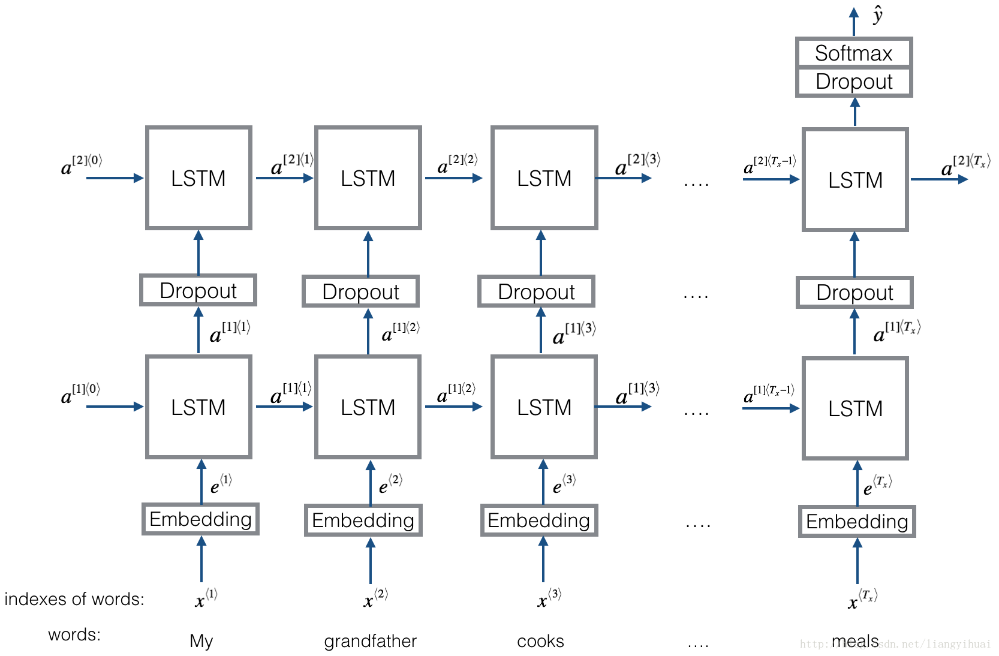
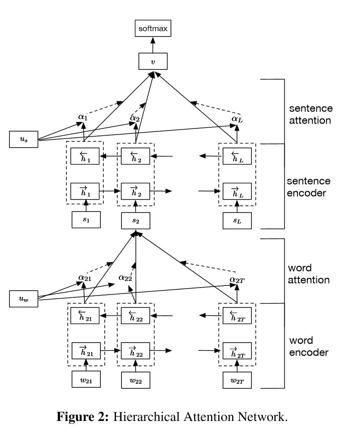
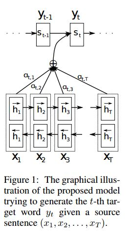

# **Geolocation Prediction from Social Media Posts**

This repository contains the implementation of multiple deep learning models designed to predict geolocation information (such as the state or coordinates) from social media posts. The models make use of text classification and regression tasks for geolocation prediction.

### **Dataset**
For this project, we are using a custom dataset of social media posts, which includes content and location labels. The dataset is used to train models that predict geographic locations based on text.

Dataset source: [Insert dataset link here]

### **Implemented Models**

1. **Text CNN**
   - Convolutional Neural Networks for Sentence Classification as described in [Yoon Kim's paper](http://www.aclweb.org/anthology/D14-1181).
   - **Structure:**  
     Embedding → Convolutional Layer → Max Pooling → Fully Connected Layer → Softmax
   
2. **Text RNN**
   - Implementation based on [Emojifier-v2 model](https://blog.csdn.net/liangyihuai/article/details/79340738).
   - **Structure:**  
     Embedding → Bi-directional LSTM → Dropout → Concatenate Output → LSTM → Dropout → Fully Connected Layer → Softmax
   - 

3. **Text RCNN**
   - Implementation of [Recurrent Convolutional Neural Network for Text Classification](https://www.aaai.org/ocs/index.php/AAAI/AAAI15/paper/download/9745/9552).
   - **Structure:**  
     Recurrent Structure (Convolutional Layer) → Max Pooling → Fully Connected Layer → Softmax

4. **FastText**
   - Based on the model from [Bag of Tricks for Efficient Text Classification](https://arxiv.org/abs/1607.01759).
   - **Structure:**  
     After embedding each word, average the word representations into a text representation, which is passed into a linear classifier. N-gram features are included, and hierarchical softmax speeds up training.

5. **Hierarchical Attention Network**
   - Based on the [Hierarchical Attention Networks for Document Classification](https://www.cs.cmu.edu/~diyiy/docs/naacl16.pdf).
     
      
   - **Structure:**  
     Embedding → Bi-directional GRU → Word-level Attention → Sentence-level Attention → Fully Connected Layer → Softmax

6. **BiLSTMTextRelation**
   - Derived from the Dual LSTM Encoder model in [The Ubuntu Dialogue Corpus: A Large Dataset for Research in Unstructured Multi-Turn Dialogue Systems](https://arxiv.org/abs/1506.08909).
   - **Structure:**  
     Embedding → Bi-directional LSTM → Dropout → Concatenate Output → LSTM → Dropout → Fully Connected Layer → Softmax

7. **Seq2Seq with Attention**
   - Based on the Seq2Seq model with attention from [Neural Machine Translation by Jointly Learning to Align and Translate](https://arxiv.org/pdf/1409.0473.pdf).
     *Structure:*  
    Embedding --> Bi-directional GRU --> Decoder with attention  
      
    *Input Data:*  
    There are two kinds of three kinds of inputs:1)encoder inputs (a sentence),  2)decoder inputs(labels list with fixed length; 3)target labels, it is also a list of labels.     
    For example, labels is:"L1 L2 L3 L4", then decoder inputs will be:[_GO,L1,L2,L2,L3,_PAD]; target label will be:[L1,L2,L3,L3,_END,_PAD]. length is fixed to 6, any exceed labels will be trancated, will pad if label is not enough to fill.  
      
    
    *Attention Mechanism:*
    i) Transfer encoder input list and hidden state of decoder  
    ii) Calculate similiarity of hidden state with each encoder input, to get possibility distribution for each encoder input.    
    iii) Compute weighted sum of encoder input based on possibility distribution.    
    iv) Go though RNN Cell using this weight sum together with decoder input to get new hidden state    

    *How Vanilla Encoder Decoder Works:* 
    The source sentence will be encoded using RNN as fixed size vector ("thought vector").  
      
    During training, another RNN will be used to try to get a word by using this "thought vector" as init state, and take input from decoder input at each timestamp. decoder start from special token "_GO". after one step is performanced, new hidden state will be get and together with new input, we can continue this process until we reach to a special token "_END". we can calculate loss by compute cross entropy loss of logits and target label. logits is get through a projection layer for the hidden state(for output of decoder step(in GRU we can just use hidden states from decoder as output).

    During testing, there is no label. so we should feed the output we get from previous timestamp, and continue the process util we reached "_END" TOKEN.

8. **CNN with Attention**
   - Inspired by [Neural Relation Extraction with Selective Attention](http://nlp.csai.tsinghua.edu.cn/~lyk/publications/acl2016_nre.pdf).
   - **Structure:**  
     Convolutional Layer → Attention Mechanism → Fully Connected Layer → Softmax

### **Installation**

To run the project, follow these steps:

## Clone the Repository
git clone https://github.com/Shristirajpoot/GeoTagNet.git
cd geolocation-prediction
Install the required dependencies:

pip install -r requirements.txt

Train a model:

python main.py -d datasets/your-dataset

Evaluate the model:

python evaluate.py

Use the following command to install all dependencies:

pip install -r requirements.txt

## Usage:
1. Neural network models can be found in the models folder.

## Envionment:
python 2.7   
Tensorflow 1.4.1  
Numpy  
## Reference:  
1. [Bag of Tricks for Efficient Text Classification](https://arxiv.org/abs/1607.01759)  

2. [Convolutional Neural Networks for Sentence Classification](http://www.aclweb.org/anthology/D14-1181)  

3. [A Sensitivity Analysis of (and Practitioners' Guide to) Convolutional Neural Networks for Sentence Classification](https://arxiv.org/abs/1510.03820)  

4. [Deep Learning for Chatbots, Part 2 – Implementing a Retrieval-Based Model in Tensorflow](http://www.wildml.com/2016/07/deep-learning-for-chatbots-2-retrieval-based-model-tensorflow/)   

5. [Recurrent Convolutional Neural Network for Text Classification](https://www.aaai.org/ocs/index.php/AAAI/AAAI15/paper/download/9745/9552)      

6. [Hierarchical Attention Networks for Document Classification](http://www.cs.cmu.edu/~./hovy/papers/16HLT-hierarchical-attention-networks.pdf)    

7. [Relation Classification via Convolutional Deep Neural Network](http://www.aclweb.org/anthology/C14-1220)   

8. [ABCNN: Attention-Based Convolutional Neural Network for Modeling Sentence Pairs](https://arxiv.org/pdf/1512.05193.pdf)  

9. [Neural Relation Extraction with Selective Attention over Instances](http://nlp.csai.tsinghua.edu.cn/~lyk/publications/acl2016_nre.pdf)  
